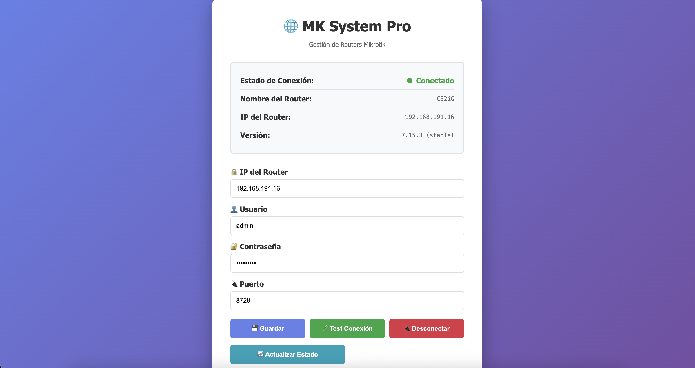

# MK API

Sistema de gestión y monitoreo para routers Mikrotik con API REST e interfaz web.

## 📋 Características

- 🔐 **Autenticación segura** con encriptación Fernet para proteger contraseñas
- 🔄 **Recolección automática de datos** con scheduler background (APScheduler)
- 📊 **API REST completa** para acceder a recursos, colas, direcciones IP y firewall del router
- 💾 **Base de datos SQLite** para almacenar configuración y datos históricos
- 🌐 **Interfaz web** para configurar conexiones con routers Mikrotik
- 🛡️ **Manejo robusto de errores** en todas las operaciones
- 🐍 **Framework moderno** con FastAPI y SQLAlchemy

## 📁 Estructura del Proyecto

```
mk-api/
├── app/
│   ├── __init__.py                  # Inicializador del paquete
│   ├── main.py                      # Aplicación FastAPI principal
│   ├── config.py                    # Configuración (variables de entorno)
│   │
│   ├── api/                         # Endpoints de la API
│   │   ├── __init__.py
│   │   ├── ip_firewall.py          # Endpoints para reglas de firewall
│   │   ├── queues.py               # Endpoints para colas simples
│   │   ├── system.py               # Endpoints para información del sistema
│   │   └── ppp.py                  # Endpoints para conexiones PPP
│   │
│   ├── services/                    # Servicios y lógica de negocio
│   │   ├── __init__.py
│   │   └── mikrotik_service.py     # Servicios de conexión a Mikrotik
│   │
│   ├── database/                    # Capa de datos
│   │   ├── __init__.py
│   │   ├── db.py                   # Configuración de SQLAlchemy e inicialización
│   │   └── models.py               # Modelos ORM de SQLAlchemy
│   │
│   ├── security/                    # Seguridad y criptografía
│   │   ├── __init__.py
│   │   └── crypto.py               # Encriptación y desencriptación de contraseñas
│   │
│   ├── scheduler/                   # Tareas programadas
│   │   ├── __init__.py
│   │   └── collector.py            # Recolector de datos en background
│   │
│   └── templates/                   # Plantillas HTML
│       └── config.html             # Interfaz de configuración web
│
├── .env.example                     # Template de variables de entorno
├── .gitignore                       # Archivos a ignorar en Git
├── requirements.txt                 # Dependencias Python
├── verify_imports.py                # Script para verificar imports
├── run.sh                           # Script para ejecutar en macOS/Linux
├── run.bat                          # Script para ejecutar en Windows
└── README.md                        # Este archivo
```

## 🔧 Requisitos

- **Python 3.8+**
- **Router Mikrotik** con API habilitada (puerto 8728 por defecto)
- **pip** (gestor de paquetes de Python)

## 🚀 Instalación

### 1. Clonar el repositorio
```bash
git clone <repository-url>
cd mk-api
```

### 2. Crear entorno virtual
```bash
# macOS / Linux
python3 -m venv venv
source venv/bin/activate

# Windows
python -m venv venv
venv\Scripts\activate
```

### 3. Instalar dependencias
```bash
pip install -r requirements.txt
```

### 4. Configurar variables de entorno
```bash
cp .env.example .env
```

Edita el archivo `.env` con tus credenciales:
```env
# Configuración del Router Mikrotik
ROUTER_HOST=192.168.1.1          # IP del router
ROUTER_USERNAME=admin            # Usuario del router
ROUTER_PASSWORD=password         # Contraseña del router
ROUTER_PORT=8728                 # Puerto API de Mikrotik

# Base de datos
DATABASE_URL=sqlite:///./database.sqlite

# Encriptación (se genera automáticamente la primera vez)
ENCRYPTION_KEY=
```

### 5. (Opcional) Verificar imports
```bash
python verify_imports.py
```

## ▶️ Ejecución

### Opción 1: Usar el script (macOS/Linux)
```bash
chmod +x run.sh
./run.sh
```

### Opción 2: Usar el script (Windows)
```bash
run.bat
```

### Opción 3: Iniciar manualmente
```bash
uvicorn app.main:app --reload --host 0.0.0.0 --port 8000
```

La aplicación estará disponible en: **http://localhost:8000**

## 📡 Endpoints de la API

### Configuración Web
```
GET /config             - Página de configuración
POST /config            - Guardar configuración del router
```

### Información del Router


```
GET /config
GET /router/system/resources    
GET /router/system/identity
GET /router/system/health
GET /router/queues              
GET /router/ppp/interfaces      
GET /router/ppp/servers
GET /router/ppp/profiles
GET /router/ppp/active
GET /router/addresses_list      
GET /router/addresses_list/list/{list_name}
GET /router/addresses_list/ip/{ip_address}
GET /router/firewall/mangle
```

## 🔒 Características de Seguridad

| Característica | Descripción |
|---|---|
| **Encriptación Fernet** | Las contraseñas se encriptan antes de guardarse |
| **Variables de Entorno** | Credenciales protegidas, no hardcodeadas |
| **Gestión de Sesiones** | Uso seguro de context managers en SQLAlchemy |
| **Manejo de Errores** | Excepciones capturadas y reportadas correctamente |

## ⏱️ Scheduler Automático

El sistema incluye un recolector de datos que se ejecuta automáticamente:

- **Frecuencia**: Cada 60 segundos
- **Datos recolectados**:
  - Carga de CPU
  - Memoria disponible y total
  - Timestamp de recolección
- **Almacenamiento**: Base de datos SQLite con historial

## 🛠️ Tecnologías Usadas

| Tecnología | Propósito |
|---|---|
| **FastAPI** | Framework web moderno y rápido |
| **SQLAlchemy** | ORM para gestión de base de datos |
| **Cryptography** | Encriptación de datos sensibles |
| **APScheduler** | Tareas programadas automáticas |
| **Routeros API** | Cliente para conectar con Mikrotik |
| **Uvicorn** | Servidor ASGI de alto rendimiento |
| **Jinja2** | Renderizado de plantillas HTML |

## 📚 Guía de Desarrollo

### Agregar un nuevo endpoint

1. Crear el archivo en `app/api/`:
```python
# app/api/new_feature.py
from fastapi import APIRouter, Depends
from app.database.db import get_db

router = APIRouter(prefix="/api/new", tags=["features"])

@router.get("/data")
async def get_data(db: Session = Depends(get_db)):
    return {"data": "value"}
```

2. Importar en `app/main.py`:
```python
from app.api import new_feature
app.include_router(new_feature.router)
```

### Crear un nuevo modelo de datos

1. Definir en `app/database/models.py`:
```python
from sqlalchemy import Column, Integer, String
from app.database.db import Base

class MyModel(Base):
    __tablename__ = "my_table"
    id = Column(Integer, primary_key=True)
    name = Column(String, nullable=False)
```

2. Las migraciones se realizan automáticamente en `init_db()`

## 🐛 Solución de Problemas

### Error: "RouterOsApiPool connection failed"
**Causa**: No hay conexión con el router
- Verifica que el router está encendido y accesible
- Confirma que el puerto 8728 está abierto en el router
- Revisa que las credenciales en `.env` son correctas

### Error: "ENCRYPTION_KEY is not set"
**Causa**: Falta la clave de encriptación
- La primera ejecución debe generar una clave automáticamente
- Si no funciona, revisa el archivo `.env`

### Error: "database.sqlite is locked"
**Causa**: Otro proceso está usando la base de datos
- Cierra otras instancias de la aplicación
- Elimina el archivo `.sqlite-wal` si existe

## 📝 Notas Importantes

- **Base de datos**: Se crea automáticamente en `database.sqlite`
- **Logs**: Revisa la consola para ver logs de la aplicación
- **Clave de encriptación**: Guarda la `ENCRYPTION_KEY` en `.env` después de la primera ejecución
- **Credenciales del router**: Usa un usuario con permisos API en Mikrotik

## 📄 Licencia

Este proyecto es de código abierto.

## 👨‍💻 Autor

Desarrollado como herramienta de gestión para routers Mikrotik.

### Error: "Invalid encryption key"
- Elimina el archivo `.env` y crea uno nuevo
- La clave de encriptación se generará automáticamente

### Error: Module not found
- Asegúrate de instalar todas las dependencias: `pip install -r requirements.txt`
- Activa el entorno virtual correctamente

## Desarrollo

Para contribuir al proyecto:

1. Crea una rama nueva
2. Realiza tus cambios
3. Asegúrate de que todo funciona
4. Crea un pull request

## Licencia

Este proyecto está bajo licencia MIT.